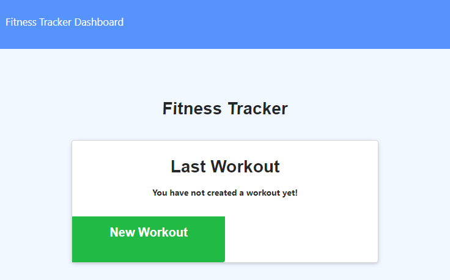
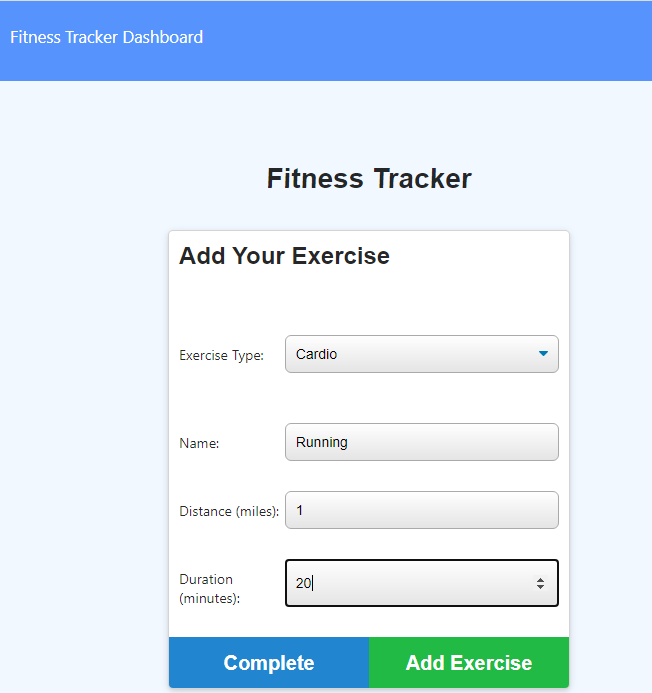
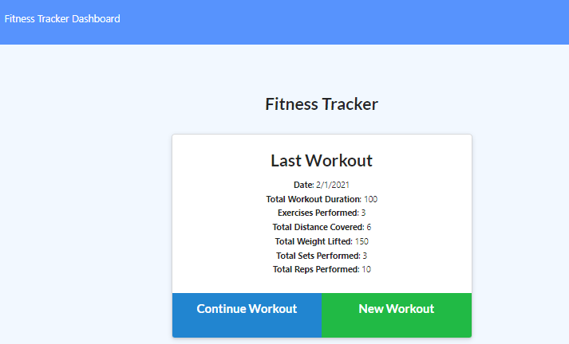
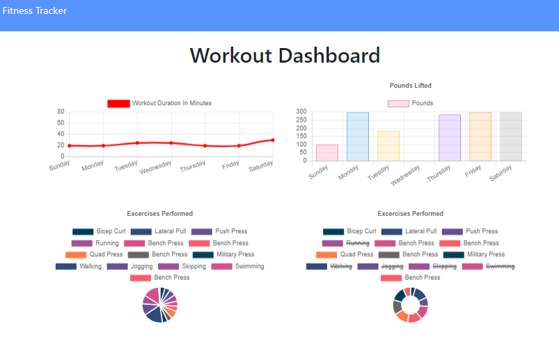

# Workout Tracker

[](https://opensource.org/licenses/MIT) 

 


  ---
  
<p>&nbsp;<p>

## Description

Workout Tracker allows user to view create and track daily workouts. The user is able to:
* Log multiple exercises in a workout
* Track the name, type, weight, sets, reps, and duration of each resistence exercise
* Track the distance traveled if the exercise was cardio based
* View stats page through their dashboard. They are presented with four charts:
  * Graph that tracks how much time in minutes he/she spent working out day by day.
  * Graph that tracks how much wight in pounds he/she lifted working out day by day.
  * Pie chart that shows the exercises completed by time.
  * Pie chart that shows the exercises completed by weight.

<p>&nbsp;<p>

## Table of Contents
* [Installation](#installation)
* [Usage](#usage)
* [License](#license)
* [Contributing](#contributing)
* [Tests](#tests)

<p>&nbsp;<p>

## Installation

To install dependencies when executing on localhost, run the following:

```
npm i
```
To seed the MongoDB database:
```
npm run seed
```

### Built with
* Javascript
* [MorganDB](https://mongodb.com/)
* [npm](https://nodejs.org/en/)
* [npm express](https://www.npmjs.com/package/express)
* [npm mongoose](https://www.npmjs.com/package/mongoose)
* [MongoDB Atlas](https://www.mongodb.com/cloud/atlas)
* [Heroku](www.heroku.com)
* [Visual Studio Code](code.visualstudio.com)

<p>&nbsp;<p>

## Usage

To run on localhost:

```
npm run start
```

### Heroku Link
[Heroku Workout Tracker Link](https://obscure-sierra-98370.herokuapp.com/)

When the user enters the main page, he/she will see the most recent workout details. If the user has not entered any workouts yet, he/she be asked to start a new workout. If the user has already entered one previously, they can choose to continue their previous workout, or begin a new one. Either way, the user will be asked to enter details about a resistance based exercise, or cardio. For resistance workouts, the user can add the name of the exercise, the time duration of the exercise in minutes, the weight that was lifted in pounds, the amount of sets lifted, and the reps within each set. The user can then add the workout if an entry was entered.  Otherwise, the user can add an additional exercise. For cardio, very similar, but the user will input distance in miles (if applicable), duration of the cardio exercise in minutes, and the name of the exercise performed. When completely finished adding all exercises within a workout routine, the user can add the workout by pressing the "Complete" tab. The user will will be re-directed to the main page and presented with the totals of the workout that was just logged. The user can view graphs of the workouts on the dashboard.  These graphs will give workout duration totals on a line chart, weight lifted totals on a bar chart, and breakdown percentages of how much of the workout was spent on each exercise via pie charts.

<p>&nbsp;<p>

### Sample Screenshots

### Workout Tracker Main Page with no previous data

### Workout Tracker Add Exercise

### Workout Tracker Main Page showing last entry totals

### Workout Tracker Stats Page Image


<p>&nbsp;<p>

## License


This repository is licensed under the MIT License.
[](https://opensource.org/licenses/MIT)

<p>&nbsp;<p>

## Contributing

This repository is a homework project and is not accepting contributions.
